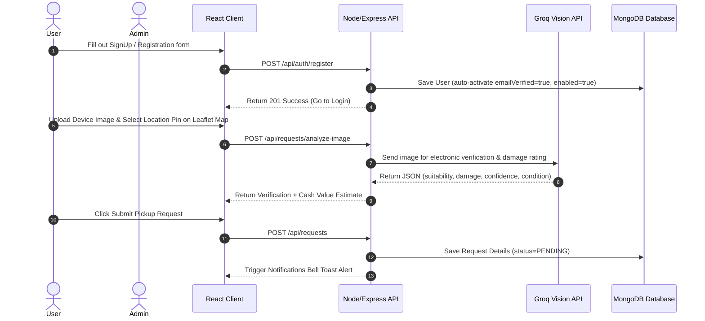

# Smart E-Waste Management System (EcoSync)

A full-stack, enterprise-grade **MERN (MongoDB, Express.js, React, Node.js) Stack** platform designed to streamline and automate the collection, estimation, and recycling of electronic waste (e-waste). The system integrates modern user registration, secure JWT authentication, real-time map location picking, **AI-powered electronic device verification, value estimation & damage assessment**, and automated scheduling.

---

## 1. Project Statement & Outcomes

### The Problem
Improper disposal of electronic items leads to significant environmental hazards. Many citizens are willing to recycle but lack an interactive, reliable, and convenient pickup system, while waste collection agencies struggle with manual verification, schedule coordination, and logistics.

### The Solution
The **Smart E-Waste Collection and Management System (EcoSync)** provides:
* **For Users:** An intuitive, mobile-responsive portal to upload details of defunct electronics, run instant **AI Vision evaluations** on device suitability, damage, and cash value estimates, select precise pickup addresses via an interactive map, and receive real-time toast alerts.
* **For Admins:** A centralized dashboard displaying real-time metrics, AI photo verification logs, and precise coordinates, allowing admins to approve/reject requests, request better photos, schedule pickup slots, and view aggregated AI Insights.

---

## 2. Technology Stack

* **Backend:** Node.js, Express.js, Mongoose ODM, MongoDB Atlas (Cloud Database), JWT, bcryptjs.
* **Frontend:** React 18, Vite, Tailwind CSS, Leaflet Map API (Interactive Location Picker), Lucide Icons.
* **AI Engine:** Groq API (`llama-3.2-11b-vision-preview` model) with offline local fallback mocks.
* **Communications:** Resend Email API SDK (fully stubbed out for local testing and bypassed verification constraints for frictionless demo logins).

---

## 3. Core Modules & Project Working Flow



### User Workflow
1. **Account Setup:** The user registers on the Register page. The system automatically creates, enables, and verifies the account instantly, redirecting the user directly to the Login page.
2. **Disposal Request:** The user enters device details, uploads device photos, and uses the interactive Leaflet map picker to drop a coordinate pin.
3. **AI Image Verification:** The user triggers AI evaluation. The system uses a vision model to verify whether the item is a valid electronic device. If verified, the user receives an instant recyclable yield percentage and cash valuation.
4. **Real-time Tracking:** The user tracks their request status on their dashboard and receives bell notifications.
5. **View AI Bill PDF:** For approved or completed pickups, the user can click a button to view and print/save a gorgeous **AI Bill & Green Environmental Impact Certificate** summarizing unit base values, carbon offsets, landfill space saved, and metallic yield statistics.

### Admin Workflow
1. **Dashboard Metrics:** The admin views active requests, status tallies, and user metrics.
2. **Review Details:** The admin inspects the user-submitted photos alongside the AI's assessment (confidence levels, damage levels, visible parts, safety instructions).
3. **Status Changes:** The admin can:
   * **Approve** the pickup request.
   * **Reject** the request.
   * **Request Better Images** (setting status to `BETTER_IMAGES_REQUIRED`).
4. **Scheduling Slot:** The admin schedules a pickup date and time, which automatically updates the user's dashboard and pushes notifications.
5. **AI Administrative Insights:** The admin can view dynamic Monthly volume reports, carbon forecasts, common user query statistics, and strategic forecasts generated dynamically via database statistics.

---

## 4. Database Schema Design (MongoDB)

* **`User` Collection:**
  * Stores user profiles, credentials, role tags (`USER`, `ADMIN`), profile pictures, and active state flags.
* **`OtpStore` Collection:**
  * Temporary stores OTP verification payloads, purpose descriptors, and TTL expiration settings.
* **`EwasteRequest` Collection:**
  * Stores device parameters, quantity, coordinate objects (`pickupLat`, `pickupLng`), images array, status state, and scheduling details.
  * Stores AI report logs: `isElectronicDevice`, `isSuitableForRecycling`, `aiDamageLevel`, `aiConfidenceScore`, `estimatedValue`, `recyclablePercentage`, `environmentalImpact`, `valuationReason`.
* **`Notification` Collection:**
  * Stores real-time alert headings, message descriptions, user links, and read/unread flags.
* **`ChatHistory` Collection:**
  * Stores history records for the AI EcoBot chat assistant.

---

## 5. Development Setup & Execution

### Prerequisites
* Node.js v18+
* MongoDB (Local instance or MongoDB Atlas Cloud account)

### Backend Configuration
1. Navigate to the `backend` folder and create a `.env` file:
   ```env
   PORT=8081
   MONGODB_URI=your_mongodb_connection_string
   JWT_SECRET=your_jwt_signature_secret
   ```
2. Install dependencies and start the backend:
   ```bash
   cd backend
   npm install
   npm start
   ```

### Database Cleanup Utility
To wipe the database collections (requests, notifications, users, chat logs) and restore a clean, active default Admin account for grading demonstrations, run:
```bash
cd backend
node scripts/cleanDb.js
```
* **Admin Email:** `admin@ewaste.com`
* **Admin Password:** `AdminPassword123`

### Frontend Configuration
1. Install dependencies:
   ```bash
   cd e-waste-system-main
   npm install
   npm run dev
   ```
2. Open `http://localhost:5173/` in your browser. (The app will automatically route requests to `localhost:8081` in development mode, and switch to your live Render backend in production mode!).
