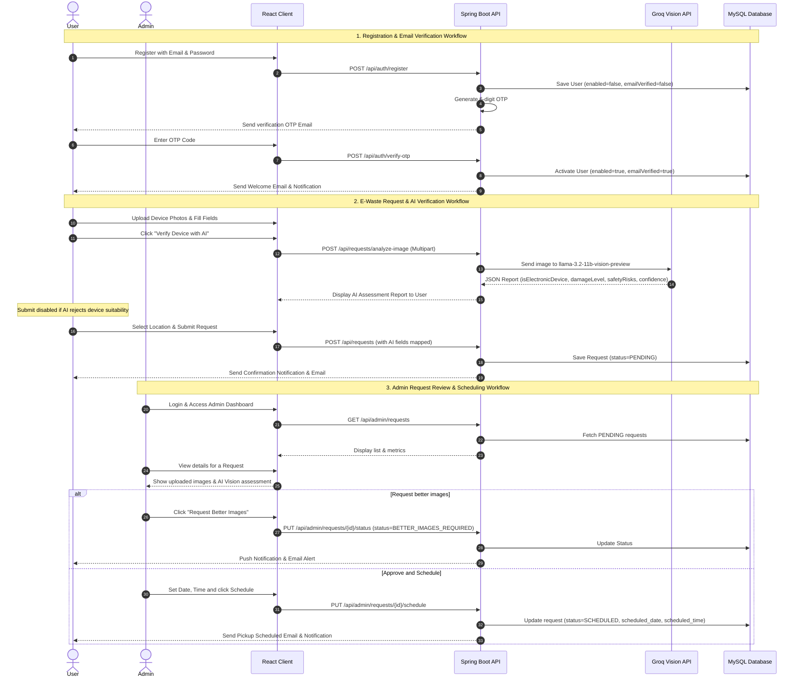

# Smart E-Waste Collection and Management System

A full-stack, enterprise-grade platform designed to streamline and automate the collection and recycling of electronic waste (e-waste). The system integrates modern user registration, secure JWT authentication, real-time map location picking, **AI-powered electronic device verification and damage assessment**, and automated scheduling with email notifications.

---

## 1. Project Statement & Outcomes

### The Problem
Improper disposal of electronic items leads to significant environmental hazards. Many citizens are willing to recycle but lack an interactive, reliable, and convenient pickup system, while waste collection agencies struggle with manual verification, schedule coordination, and logistics.

### The Solution
The **Smart E-Waste Collection and Management System** provides:
* **For Users:** An intuitive, mobile-responsive portal to upload details of defunct electronics, run instant **AI Vision evaluations** on device suitability and damage, select precise pickup addresses via an interactive map, and receive real-time updates.
* **For Admins:** A centralized dashboard displaying real-time metrics, AI photo verification logs, and precise coordinates, allowing admins to approve/reject requests, request better photos, and schedule pickup slots which automatically trigger email updates.

---

## 2. Technology Stack

* **Backend:** Java 17, Spring Boot 3.x, Spring Data JPA, Hibernate, Spring Security (JWT-based stateless authentication), Maven, Lombok, MySQL.
* **Frontend:** React 18, Vite, Tailwind CSS, Leaflet/Mapbox API (Interactive Map Location Picker), Lucide Icons.
* **AI Engine:** Groq API (`llama-3.2-11b-vision-preview` model) with offline local json fallbacks.
* **Communications:** JavaMail Sender SMTP integration (Gmail App Passwords).

---

## 3. Core Modules & Project Working Flow



### User Workflow
1. **Account Setup:** The user registers. The system generates a 6-digit OTP code sent via Gmail SMTP. The account is set to inactive.
2. **OTP Verification:** The user submits the OTP to activate their account. OTP resends are rate-limited with a 60-second cooldown timer. On success, a welcome email is sent.
3. **disposal request:** The user enters device details, uploads device photos, and uses the map picker to drop a coordinates pin.
4. **AI Image verification:** The user triggers AI evaluation. The system uses a vision model to verify whether the item is a valid electronic device. If verified, the submit button is enabled; if rejected, the user is notified with the AI reason.
5. **Real-time Tracking:** The user tracks their request status on their dashboard and receives bell notifications.

### Admin Workflow
1. **dashboard metrics:** The admin views active requests, status tallies, and user metrics.
2. **Review Details:** The admin inspects the user-submitted photos alongside the AI's assessment (confidence levels, damage levels, visible parts, safety instructions).
3. **status changes:** The admin can:
   * **Approve** the pickup request.
   * **Reject** the request.
   * **Request Better Images** (setting status to `BETTER_IMAGES_REQUIRED`).
4. **scheduling slot:** The admin schedules a pickup date and time. An automated notification email is dispatched to the user.

---

## 4. Database Schema Design

* **`users` Table:**
  * Stores user profiles, credentials, role tags (`USER`, `ADMIN`), and state flags (`enabled`, `email_verified`).
* **`otp_store` Table:**
  * Stores OTP payloads, purpose descriptors (`REGISTRATION`), and timestamp parameters for expiration checks.
* **`ewaste_requests` Table:**
  * Stores device parameters, quantity, address coordinates (`pickup_lat`, `pickup_lng`), images array, and scheduling details.
  * Stores AI report logs: `is_electronic_device`, `is_suitable_for_recycling`, `ai_damage_level`, `ai_confidence_score`, `ai_safety_risks`, `ai_repair_recommendation`.
* **`notifications` Table:**
  * Stores real-time alert headings, messages, and read flags.

---

## 5. Development Milestones

* **Milestone 1 (Weeks 1–2):** Authentication & Profile setup (Completed registration OTP verification and Gmail welcome SMTP services).
* **Milestone 2 (Weeks 3–4):** Request Submission Module (Completed interactive map picking, file uploads, and status tracker screens).
* **Milestone 3 (Weeks 5–6):** Admin Control & Notifications (Completed dashboards, status modification routes, scheduling, and notifications bell triggers).
* **Milestone 4 (Weeks 7–8):** Testing & Documentation (Completed integration testing scripts and codebase deployment readiness).

---

## 6. How to Run Locally

### Prerequisites
* Java JDK 17+
* Node.js v18+
* MySQL 8.x DB

### Running the Backend
1. Create a MySQL database named `ewaste_db`.
2. Configure credentials in `backend/src/main/resources/application.properties`.
3. Build and launch:
   ```bash
   cd backend
   mvn clean compile
   mvn spring-boot:run
   ```

### Running the Frontend
1. Install dependencies:
   ```bash
   cd e-waste-system-main
   npm install
   npm run dev
   ```
2. Open `http://localhost:5173/` in your browser.
